# DivAirCity Urban Data Framework


**End-to-end data modeling and pipeline implementation for a multi-city EU Horizon 2020 sustainability project.**

## TL;DR

- Portfolio reconstruction of the **urban data management framework** I designed for EU Horizon 2020 DivAirCity (WP2), implemented as a working **dbt + Snowflake pipeline**
- 25 entities, 60+ KPIs, GDPR-compliant data model
- End-to-end implementation: Conceptual model → Physical schema → dbt marts

## Project Context

The [DivAirCity project](https://divaircity.eu/) (EU Horizon 2020, Grant No. 101003799) analysed diversity, inclusion, and air quality across five European pilot cities, with London as an additional data source.

**My role:** As **Senior Urban Data Analytics Expert** and **WP2 Leader**, I designed the conceptual data model and entity specifications (Deliverable 2.2) — 25 entities, 60+ KPIs based on [BSI PAS 182](https://www.bsigroup.com/en-GB/smart-cities/smart-cities-pas-182/).

**This repo:** A portfolio reconstruction of the framework as a working dbt + Snowflake pipeline. All data is **mock/synthetic**.

## What This Demonstrates

| Skill                            | Implementation                                                                |
| -------------------------------- | ----------------------------------------------------------------------------- |
| **Conceptual Data Modeling**     | ERD with normalized dimensional hierarchies based on BSI PAS 182              |
| **Snowflake Schema Design**      | Geographic hierarchy: Country → City → Borough → Neighbourhood → Location     |
| **Star Schema / Fact-Dimension** | `fact_sensor_measurement`, `fact_event_participation`, `fact_survey_response` |
| **SQL DDL**                      | Snowflake-dialect `CREATE TABLE` with PK/FK constraints and data types        |
| **dbt Transformation**           | Staging → Intermediate → Marts (medallion-aligned)                            |
| **Data Visualization**           | Power BI dashboards with geospatial mapping, sentiment analysis, KPI tracking |
| **Data Governance**              | Entity specifications with data types, relationships, and usage notes         |

## Architecture

```mermaid
flowchart LR
    subgraph Sources["🌍 6 Cities"]
        direction TB
        O[Orvieto]
        P[Potsdam]
        A[Aarhus]
        C[Castellon]
        B[Bucharest]
        L[London]
    end

    subgraph Pipeline["⚙️ Data Pipeline"]
        direction LR
        Bronze["🥉 Bronze<br/>27 raw tables"]
        Silver["🥈 Silver<br/>27 staging + 5 intermediate"]
        Gold["🥇 Gold<br/>6 marts"]
        Bronze --> Silver --> Gold
    end

    subgraph Output["📊 Analytics"]
        direction TB
        PBI[Power BI]
        API[Reports]
    end

    Sources --> Pipeline --> Output
```



📘 **More details:** [docs/architecture.md](docs/architecture.md) — data flow diagrams, six-domain model, and key design decisions

## Repo Structure

```
├── docs/
│   ├── architecture.md              # Detailed architecture & design decisions
│   ├── kpi-framework.md             # KPI methodology & data clusters
│   ├── privacy-gdpr.md              # GDPR compliance & ethics
│   ├── dashboards/                  # Power BI exports
│   └── erd/                         # Entity-relationship diagrams
├── sql/
│   ├── 01_create_schemas.sql        # Snowflake schema setup
│   ├── 02_dimension_tables.sql      # 24 dimension tables
│   ├── 03_fact_tables.sql           # 3 fact tables
│   └── 04_sample_queries.sql        # Analytical queries
└── dbt_project/
    ├── models/
    │   ├── staging/                 # Bronze → Silver
    │   ├── intermediate/            # Business logic
    │   └── marts/                   # Gold (analytics-ready)
    └── seeds/                       # Mock reference data (CSV)
```

## Quickstart

```bash
# 1. Set up Snowflake schemas
#    Execute: sql/01_create_schemas.sql → 02 → 03

# 2. Configure dbt
cp dbt_project/profiles.yml.example ~/.dbt/profiles.yml

# 3. Run pipeline
cd dbt_project
dbt deps && dbt seed && dbt run && dbt test
```

## Learn More

| Topic | Document |
|-------|----------|
| **Architecture** | [docs/architecture.md](docs/architecture.md) — Data flow, 6 domains, design decisions |
| **KPI Framework** | [docs/kpi-framework.md](docs/kpi-framework.md) — 3 impact areas × 9 data clusters |
| **Privacy & GDPR** | [docs/privacy-gdpr.md](docs/privacy-gdpr.md) — GDPR compliance, sensitive data handling |
| **ERD** | [docs/erd/divaircity_erd.mermaid](docs/erd/divaircity_erd.mermaid) — Full entity-relationship diagram |
| **Dashboards** | [docs/dashboards/](docs/dashboards/) — Power BI dashboard exports |

## Tech Stack

- **Data Warehouse:** Snowflake
- **Transformation:** dbt
- **Modeling Standard:** BSI PAS 182 Smart City Concept Model
- **Source Project:** EU Horizon 2020 DivAirCity (Grant No. 101003799)

## About

Personal portfolio project reconstructed from my work on DivAirCity.

- **Original work:** Conceptual data model and entity specifications (D2.2)
- **This repo:** SQL DDL and dbt pipeline implementation
- **Data:** All mock/synthetic — no real project data included
