# Architecture

Detailed technical architecture of the DivAirCity data framework, explaining how the conceptual data model is translated into a physical Snowflake schema and a dbt-based transformation pipeline.

## System Overview

High-level view of how multi-city urban data flows from raw sources into analytics-ready marts using a medallion-style architecture.

## Data Flow (Medallion Architecture)

This pipeline follows a medallion architecture to progressively clean, enrich, and reshape raw urban data into analytics-ready fact tables.

```mermaid
flowchart LR
    subgraph Bronze["🥉 Bronze"]
        R1[raw_sensors]
        R2[raw_measurements]
        R3[raw_events]
        R4[raw_persons]
        R5[...]
    end

    subgraph Silver["🥈 Silver"]
        S1[stg_sensor]
        S2[stg_sensor_measurement]
        I1[int_sensor_with_geography]
        I2[int_person_with_diversity]
    end

    subgraph Gold["🥇 Gold"]
        M1[mart_air_quality]
        M2[mart_participation_diversity]
        M3[mart_health_pollution]
    end

    R1 --> S1
    R2 --> S2
    S1 --> I1
    S2 --> I1
    I1 --> M1
    I1 --> M3

    R3 --> Silver
    R4 --> I2
    I2 --> M2
```

## Data Model (6 Domains)

The logical data model is organised into six domains, separating concerns between geography, actors, governance processes, measurements, and outcomes.

```mermaid
flowchart TB
    subgraph Facts["📦 Fact Tables"]
        F1[fact_sensor_measurement]
        F2[fact_event_participation]
        F3[fact_survey_response]
    end

    subgraph Geo["🗺️ Geography"]
        G1[Country]
        G2[City]
        G3[Borough]
        G4[Neighbourhood]
        G5[Location]
        G1 --> G2 --> G3 --> G4 --> G5
    end

    subgraph Agents["👥 Agents"]
        A1[Community<br/>6+1 diversity]
        A2[Organisation]
        A3[Person]
    end

    subgraph Cocreation["🤝 Co-creation"]
        C1[Plan / Phase]
        C2[Event]
        C3[Decision]
    end

    subgraph Env["🌱 Environment"]
        E1[Sensor]
        E2[NBS Project]
        E3[Building]
    end

    subgraph Social["📋 Social"]
        S1[Survey]
        S2[Public Statistics]
        S3[PANAS Score]
    end

    Geo --> F1
    Geo --> F2
    Agents --> F2
    Env --> F1
    Social --> F3
    Cocreation --> F2
```

## Domain Details

### 1. Geospatial Boundaries (Snowflake Schema)

- `COUNTRY` → `ADMIN_DIV_1` (city) → `ADMIN_DIV_2` (borough) → `ADMIN_DIV_3` (neighbourhood) → `LOCATION`

### 2. Agents

- `COMMUNITY` (6+1 diversity groups)
- `ORGANISATION`
- `PERSON`

### 3. Co-creation & Governance

- `PLAN`, `PHASE`, `OBJECTIVE`
- `ENGAGEMENT_TOOL`
- `EVENT`, `DECISION`

### 4. Social Metrics & Surveys

- `PUBLIC_STATISTICS` (demographics)
- `SURVEY`
- `CITIZEN_RESPONSE`

### 5. City Objects & Environmental

- `NBS_PROJECT` (Nature-Based Solutions)
- `SENSOR`
- `SENSOR_MEASUREMENT`

### 6. Economic

- `RESOURCE`, `METRIC`

> See [`docs/erd/divaircity_erd.mermaid`](erd/divaircity_erd.mermaid) for the full entity–relationship diagram.

## Design Principles

| Layer | Purpose | Implementation |
|-------|---------|----------------|
| **Conceptual** | BSI PAS 182 smart city model | 25 entities, 60+ KPIs |
| **Logical** | ERD with normalized schema | 24 dimensions + 3 facts |
| **Physical** | Snowflake DDL | `sql/` directory |
| **Transformation** | dbt pipeline | `dbt_project/` |

## Key Design Decisions

### Why Snowflake Schema for Geography?

The geographic hierarchy is normalised into separate dimension tables because:

- Cities report data at different administrative levels
- Each level has its own attributes (population, area) updated independently
- Cross-city comparisons require consistent geographic granularity

### Why Star Schema for Measurements?

`fact_sensor_measurement` uses a classic star schema because:

- High-volume time-series data (sensor readings every 15 minutes)
- Query patterns are analytical: aggregate by time, location, sensor type
- Wide denormalised table in the marts layer for end-user consumption

### Why Medallion Architecture in dbt?

- **Staging (Bronze→Silver):** Clean, rename, type-cast raw source data
- **Intermediate:** Apply business logic, resolve relationships
- **Marts (Gold):** Pre-joined wide tables optimised for BI tools and analysts
