# KPI Framework

This data framework was designed using a **goal-driven methodology**, ensuring that indicators, data collection, and analysis are directly linked to city-level sustainability goals. KPIs are organised across three sustainability impact areas and five co-creation phases, forming nine data clusters that define what data should be collected and why.

## Framework Overview

```mermaid
flowchart TB
    subgraph Framework["📊 KPI Framework"]
        direction TB

        subgraph Impact["3 Impact Areas"]
            direction LR
            I1["🌱 Environmental"]
            I2["👥 Social"]
            I3["💰 Economic"]
        end

        subgraph Phases["5 Co-creation Phases"]
            direction LR
            A[A. Understanding]
            B[B. Co-designing]
            C[C. Co-implementing]
            D[D. Sustainability]
            E[E. Co-monitoring]
        end

        subgraph Clusters["9 Data Clusters"]
            direction TB
            C1["Baseline indicators<br/>(x.1)"]
            C2["Dynamic indicators<br/>(x.2)"]
            C3["Monitoring indicators<br/>(x.3)"]
        end
    end

    Impact --> Clusters
    Phases --> Clusters
    Clusters --> KPI["60+ KPIs"]
    KPI --> Data["Data Requirements"]
    Data --> Pipeline["Data Pipeline<br/>(this repo)"]
```

## Data Cluster Matrix

|  | Baseline (.1) | Dynamic (.2) | Monitoring (.3) |
|--|---------------|--------------|-----------------|
| **Social** | People & governance | Participation dynamics | Social outcomes |
| **Environmental** | Urban assets & infrastructure | Environmental dynamics | Environmental outcomes |
| **Economic** | Economic baseline | Economic dynamics | Economic outcomes |

Each cell represents a distinct group of indicators aligned to both an impact area and a stage in the co-creation lifecycle.

## How It Works

This framework ensures that every data point serves a specific KPI, and that each KPI directly measures progress toward defined city sustainability goals.

### 3 Impact Areas

- **Environmental**: Air quality, nature-based solutions, carbon emissions, urban greenspace
- **Social**: Diversity & inclusion, citizen participation, health outcomes, community engagement
- **Economic**: Resource allocation, cost-benefit analysis, economic impact of interventions

### 5 Co-creation Phases

| Phase | Description | Data Focus |
|-------|-------------|------------|
| **A. Understanding** | Establishing baseline context | Static indicators, existing conditions |
| **B. Co-designing** | Collaborative solution design | Stakeholder input, requirements |
| **C. Co-implementing** | Deploying interventions | Progress tracking, resource usage |
| **D. Sustainability** | Ensuring long-term viability | Maintenance, ongoing costs |
| **E. Co-monitoring** | Measuring outcomes | Impact assessment, KPI evaluation |

### 9 Data Clusters

Each impact area has 3 data clusters aligned to the co-creation lifecycle:

1. **Baseline indicators (x.1)**: What exists before intervention?
2. **Dynamic indicators (x.2)**: What changes during implementation?
3. **Monitoring indicators (x.3)**: What outcomes do we measure?

## From City Goals to Data Requirements

| Step | Question | Example |
|------|----------|---------|
| **1. City Goal** | What does the city want to achieve? | Reduce PM2.5 exposure in vulnerable areas |
| **2. Impact** | What change do we measure? | Health outcomes in diverse communities |
| **3. Indicator** | What metric quantifies this? | Asthma admissions by neighbourhood |
| **4. Data** | What data is needed? | Sensor readings + health statistics + demographics |
| **5. Source** | Where does it come from? | IoT sensors, NHS, Census |

## Methodological Approach

The indicator identification followed a three-phase process:

1. **Phase 1**: Identify core metrics from past EU projects and COVID-19 studies
2. **Phase 2**: Review existing KPIs through diversity lens (gender, age, ethnicity); add indicators where gaps exist
3. **Phase 3**: Analyse Census data across cities; identify data gaps for diversity/inclusion

Within these phases, a two-step process was applied:

**Step 1: Define Requirements**
- Define impacts to assess (from city targets/goals)
- Identify indicators to assess impacts
- Identify data required to quantify indicators

**Step 2: Assess Data Availability**
- Check if data exists in formal sources
- Check if data can be collected during project
- Redefine or remove indicator if data unavailable
